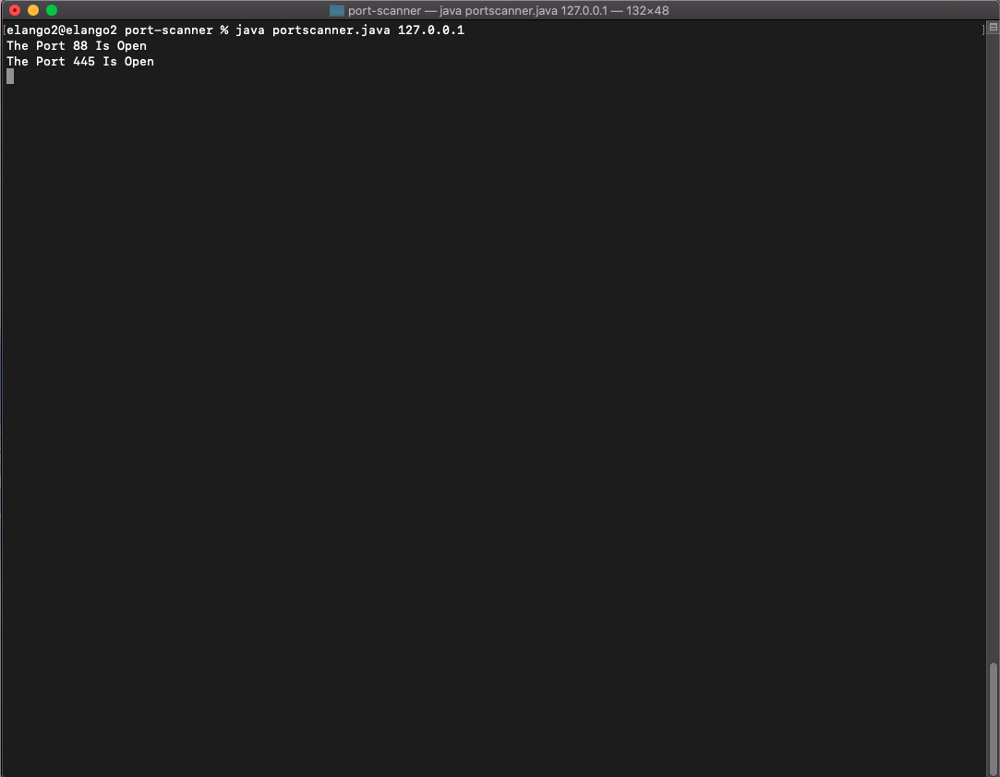

# port-scanner
a simple java code for scanning open ports on a website

# Steps To Run This Tool On Linux:
- git clone https://github.com/krishpranav/port-scanner
- cd port-scanner
- sudo chmod +x *
- java portscanner.java 

# Steps To Run This Tool On Mac:
- git clone https://github.com/krishpranav/port-scanner
- cd port-scanner
- sudo chmod +x *
- java portscanner.java 

# HOW TO SCAN OPEN PORTS ON A WEBSITE 
- use this command
- java portscanner.java 127.0.0.1

# Reference

